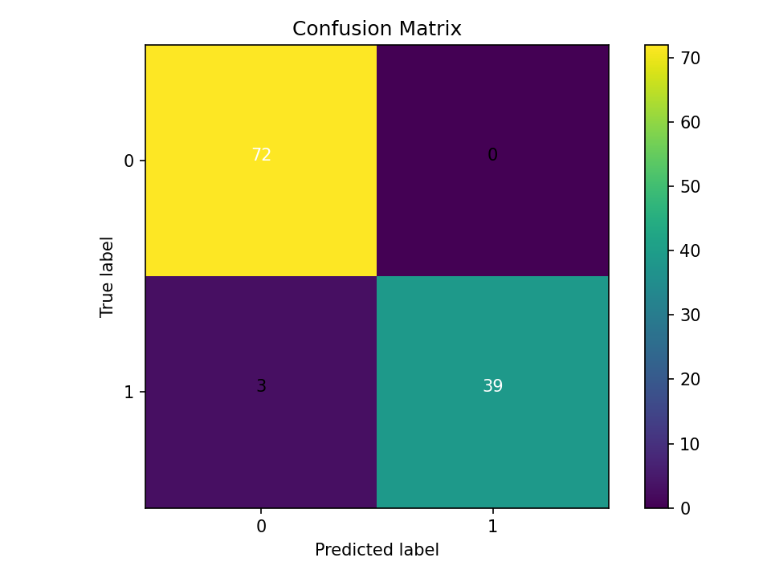
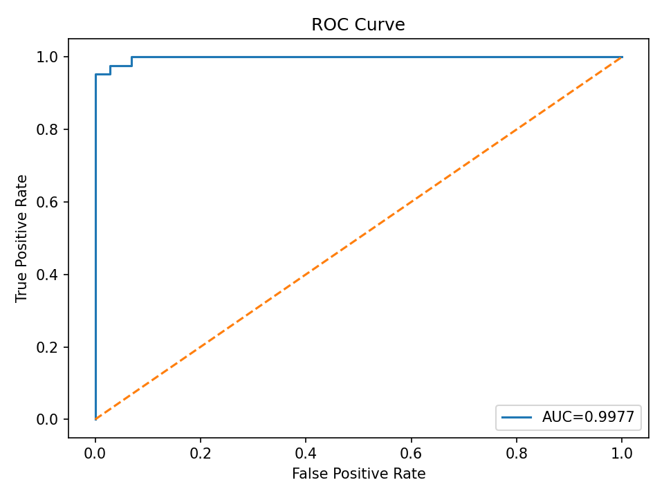

# Breast Cancer Classification with CatBoost + Optuna

This project builds a high-performing **binary classifier** on the Breast Cancer dataset using **CatBoost** with **Optuna** for hyperparameter optimization. It supports both **CSV input** and **sklearn’s built-in dataset**, saves artifacts in Kaggle-friendly paths, and produces metrics and plots for quick model diagnostics.

### Highlights
- **Flexible data ingestion:** CSV (if provided) or `sklearn.datasets.load_breast_cancer` fallback  
- **Preprocessing pipeline:** target mapping (`M/B` → `1/0`), missing value imputation, automatic categorical feature detection  
- **Stratified split** for robust evaluation  
- **Hyperparameter search** with Optuna (TPE), optimizing **AUC**  
- **Final training** with early stopping on the best params  
- **Evaluation:** Accuracy, AUC, Classification Report, **Confusion Matrix**, **ROC Curve**  
- **Artifacts:** metrics & plots saved to Kaggle working directory; model exported as `.cbm`

### Example Results (single run)
- **Best CV AUC:** `0.9959`  
- **Test Accuracy:** `0.9737`  
- **Test AUC:** `0.9977`  
- **Best params (sample):**
  - `iterations=1000, learning_rate≈0.1717, depth=4, l2_leaf_reg≈0.129, border_count=143, bagging_temperature≈4.32, random_strength≈0.329, eval_metric='AUC'`

> Results vary by split and environment. The code fixes `SEED=42` to improve reproducibility.

  

---

## Installation

```bash
pip install numpy pandas scikit-learn matplotlib catboost optuna
```

---

## Workflow

- **Config (dataclasses):**
  - `DataConfig(csv_path, target_col, test_size, drop_cols, sep, encoding, ...)`
  - `TrainConfig(n_trials, n_splits, early_stopping_rounds, auto_class_weights, ...)`
- **Load data:** `_load_dataframe_or_sklearn_fallback`
- **Prep & target mapping:** `prepare_xy`
- **Categorical indices:** `_detect_cat_features`
- **Split:** `split_train_test`
- **Tune:** `tune_with_optuna`
- **Train final:** `train_final_model`
- **Evaluate & save:** `evaluate_and_save`, `save_model`

---

## Usage (inside the notebook)

1. **Set configs**
   ```python
   CSV_PATH = "/kaggle/input/breast-cancer-dataset/Breast_cancer_dataset.csv"
   TARGET_COL = "diagnosis"
   DROP_COLS = ["id", "Unnamed: 32"]
   TEST_SIZE = 0.2
   N_TRIALS = 50
   N_SPLITS = 5
   AUTO_CLASS_WEIGHTS = "Balanced"  # or None
   OUT_DIR = "/kaggle/working/"
   EARLY_STOPPING_ROUNDS = 50
   ```
2. **Load & split**
   ```python
   df = _load_dataframe_or_sklearn_fallback(data_cfg)
   X, y = prepare_xy(df, data_cfg)
   X_train, X_test, y_train, y_test = split_train_test(X, y, data_cfg)
   cat_features = _detect_cat_features(X_train)
   ```
3. **Tune with Optuna**
   ```python
   best_params = tune_with_optuna(X_train, y_train, train_cfg, cat_features)
   ```
4. **Train final model**
   ```python
   model = train_final_model(X_train, y_train, best_params, train_cfg, cat_features)
   ```
5. **Evaluate & export**
   ```python
   evaluate_and_save(model, X_test, y_test, out_dir=OUT_DIR)
   save_model(model, os.path.join(OUT_DIR, "catboost_model.cbm"))
   ```

---

## Outputs (Kaggle-friendly)
- **Model:** `/kaggle/working/catboost_model.cbm`  
- **Metrics (JSON):** `/kaggle/working/metrics.json`  
- **Classification Report (TXT):** `/kaggle/working/classification_report.txt`  
- **Plots:**
  - ROC: `/kaggle/working/roc_curve.png`
  - Confusion Matrix: `/kaggle/working/confusion_matrix.png`

> Note: Some `os.path.join(out_dir, "/kaggle/working/...")` calls use absolute paths (leading slash). This is fine on Kaggle; adjust `OUT_DIR` for local runs if needed.

---

## Tips
- **Matplotlib backend:** `Agg` is not required in Jupyter, but it’s useful in headless environments.
- **Class imbalance:** `auto_class_weights="Balanced"` often helps.
- **Early stopping:** tune `early_stopping_rounds` for speed vs. generalization.
- **Seed:** `SEED=42` for reproducibility.

---

## Roadmap
- Out-of-fold predictions & ensembles  
- Explainability via SHAP/Permutation Importance  
- CLI/script packaging of the pipeline  
- Data validation & auto-reports
